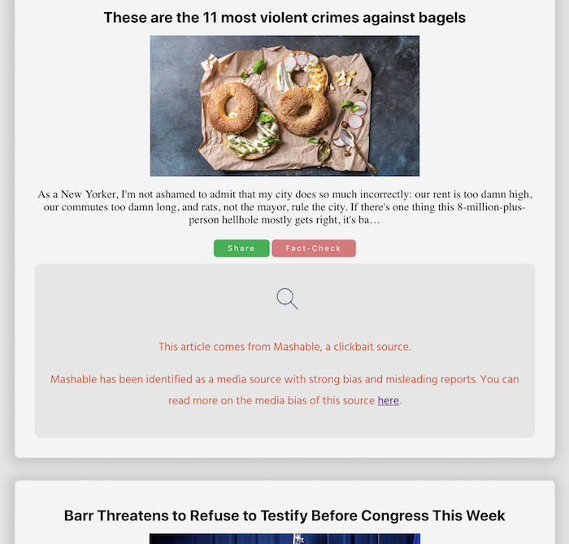

## What's the Scoop?
A study tool to promote media literacy for teens. Users will be given a simulated news feed, with a combination of credible and questionable news articles. Users can then click to "Share" or "Fact-Check" articles. Feedback is given: for reliable sources, users will be given a link to read more of the article. For low credibility pieces, users will be provided a link that explains a report detailing why the media outlet may be unreliable.

## Note:

In the project directory, you can run:

### `npm start`

Runs the app in the development mode. 
Open [http://localhost:3000](http://localhost:3000) to view it in the browser.

## Deployed link
[https://whatsthescoop.herokuapp.com/]